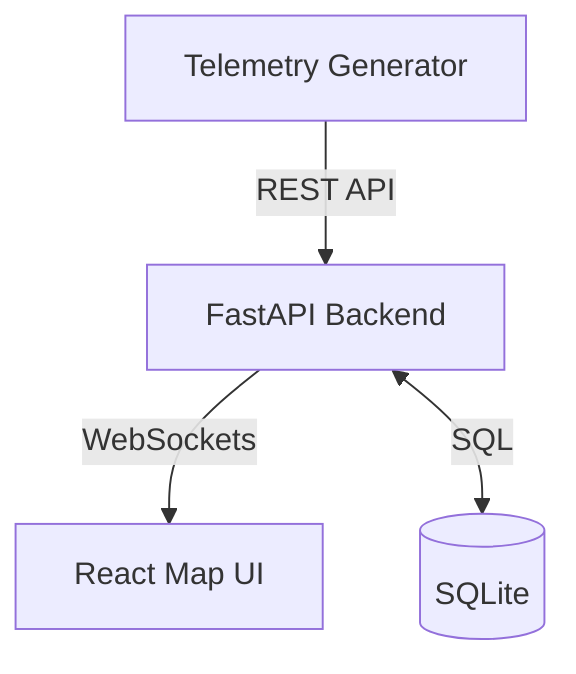
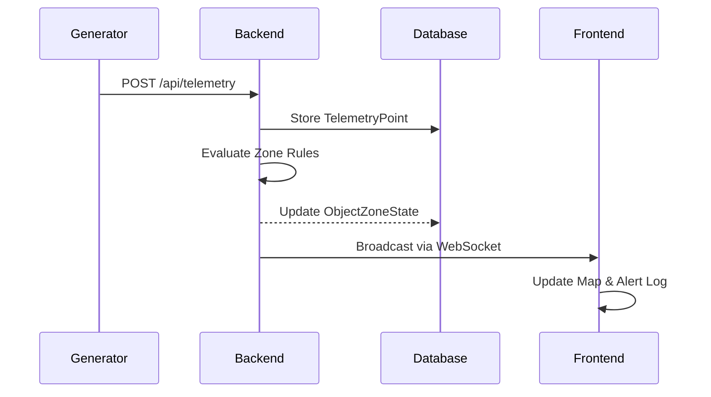

# Arctic Corridor Track and Geofence Alerts

## Overview
A real-time map-based tracking tool that ingests telemetry for multiple assets, renders their movement, and triggers alerts when assets cross user-defined zones.

## Background
I decided to choose this problem because during my interview with Ashley, we had a discussion about the mission in Feburary where snowmobiles are crossing the Arctic Corridor and Dominion Dynamics is tasked with tracking them. This problem resonated with me and I thought it would be a fun challenge to build a tool to help with this mission.

## Features
- Live object localization on a map
- Confidence value + additional telemetry fields (speed, heading, etc.)
- User drawn zones (polygon and/or bbox)
- Alerts for zone entry and exit (plus optional rules)
- Telemetry generator included for reproducible demo

## Tech Stack
- Backend: FastAPI, SQLite (SQLAlchemy/SQLModel), WebSocket (optional)
- Frontend: React + Vite + TypeScript, MapLibre GL
- Tooling: Docker Compose optional, Makefile or scripts for one-command run

### High-level components



### Data flow



### Data model
The system tracks assets using the following core entities:
- **TrackedObject**: Represents an asset (e.g., Drone-1).
- **TelemetryPoint**: A specific geo-spatial coordinate and state (speed, heading, confidence).
- **Zone**: User-defined geofences (Polygon/BBox).
- **AlertRule**: Logic defining when to trigger (e.g., ENTER, EXIT, LOW_CONFIDENCE).
- **AlertEvent**: A recorded incident when a rule is triggered.
- **ObjectZoneState**: Tracking the current relationship between an object and a zone.

## API
List endpoints with short examples:
- POST /api/telemetry
- GET /api/objects
- GET /api/objects/{id}/telemetry
- GET/POST/PUT/DELETE /api/zones
- GET /api/alerts

## Alert Logic
- Enter and exit detection uses ObjectZoneState
- Cooldown and dedupe strategy (prevent alert spam)
- Boundary rules (edge counts as inside or define explicitly)

## Failure Modes and Mitigations

- **GPS Jitter & False Positives**: Handled via confidence thresholds. Telemetry with confidence below the zone's `min_confidence` rule (e.g., `LOW_CONFIDENCE_IN_ZONE`) is flagged or filtered.
- **Stale Assets**: Objects that haven't sent telemetry within a threshold are marked as `STALE` in the UI to prevent tracking phantom movements.
- **Alert Fatigue**: 
  - **Cooldown Windows**: Rules have a configurable cooldown to prevent a single crossing from triggering dozens of alerts.
  - **Deduplication**: Consecutive identical alerts within a tight window are suppressed.
- **Performance**: 
  - Frontend downsamples historical trails.
  - Backend uses efficient point-in-polygon checks (Ray Casting) before considering database updates.

## How to Run

### Backend
1. Navigate to the backend directory:
   ```bash
   cd backend
   ```
2. Install dependencies:
   ```bash
   pip install -r requirements.txt
   ```
3. Run the FastAPI server:
   ```bash
   python -m uvicorn src.app.main:app --reload
   ```
   The backend will be available at `http://localhost:8000`. Database (`database.db`) will be created automatically on startup.

### Frontend
1. Navigate to the frontend directory:
   ```bash
   cd frontend
   ```
2. Install dependencies:
   ```bash
   npm install
   ```
3. Run the development server:
   ```bash
   npm run dev
   ```
   The frontend will be available at `http://localhost:5173`.

### Telemetry Generator
From the project root, run the simulation script to generate live movements:
```bash
python tools/telemetry_generator/generator.py
```
This script simulates drone and vehicle movements across the Canadian Arctic and sends telemetry data to the backend API.

## Demo Steps

1. **Start the Stack**: Ensure Backend, Frontend, and Generator are all running.
2. **Open the UI**: Navigate to `http://localhost:5173`.
3. **Observe Live Tracking**: You should see various assets (Drone-A, Vehicle-B) moving across the map.
4. **Create a Geofence**:
   - Select the '+' button beside the ACTIVE ZONES text.
   - Draw a zone on the map.
   - Double click on the last vertex to close the polygon.
   - Click **Save Zone**.
5. **Monitor Alerts**: When the asset enters your drawn zone, an alert will flash in the side panel and remain in the log.
6. **Test Robustness**: Close the generator and observe objects turning gray (Stale state) after ~10 seconds.

## Testing
- Unit tests for: point-in-polygon, state transitions, dedupe
- Contract tests for API schemas (optional)

## Tradeoffs and Future Work

- **SQLite vs PostGIS**: Used SQLite for portability and zero-setup during interviews. For production scale (millions of zones), moving to PostGIS for spatial indexing is recommended.
- **Ray Casting vs Topology**: Zone crossing uses a standard Ray Casting algorithm. Complex self-intersecting polygons might require more robust topological checks.
- **WebSocket Scaling**: Currently uses a simple broadcast. For high-volume multi-tenancy, a Pub/Sub model (Redis) would be necessary.
- **Additional Layers**: Future work includes weather overlay and terrain-aware height tracking (AAR).
